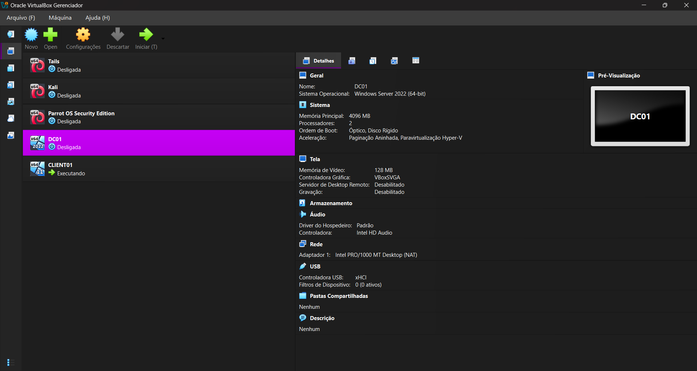
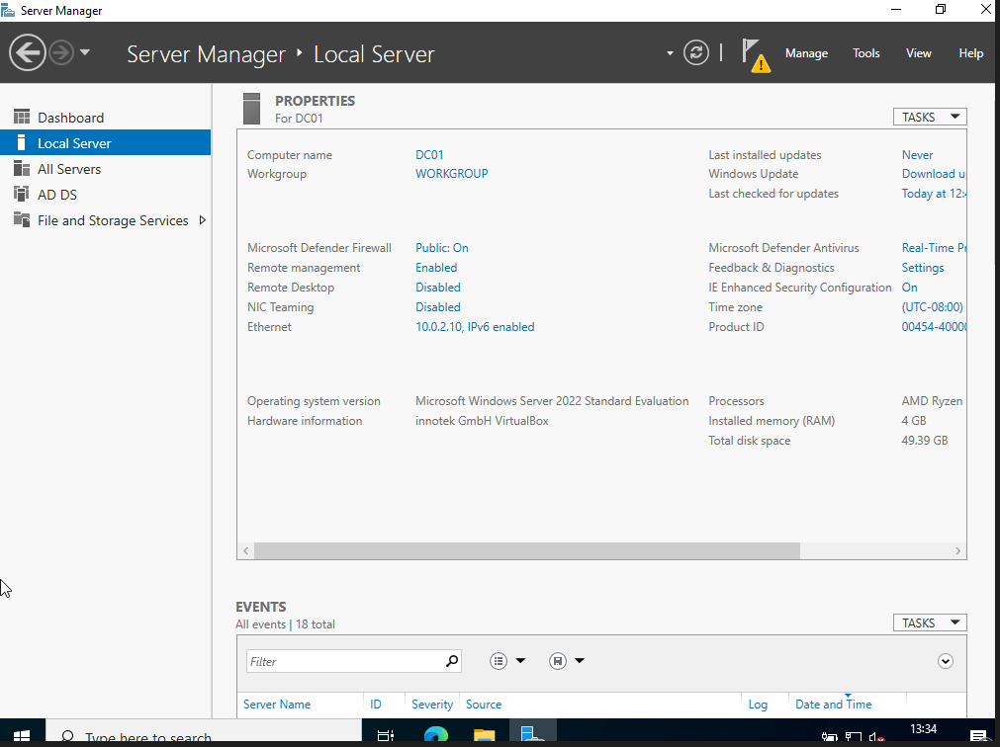

# Active Directory Home Lab

A home lab built with **Windows Server 2022** and **Windows 11 Pro** to simulate a small enterprise Active Directory environment.

This project demonstrates the deployment and administration of an Active Directory domain, including user management, Organizational Units (OUs), Group Policy, and automatic network drive mapping.

---

## Project Goals

The purpose of this lab was to gain hands-on experience with Windows Server administration by implementing common enterprise tasks such as:

- Deploying Active Directory Domain Services (AD DS)
- Configuring DNS
- Creating Organizational Units (OUs)
- Managing domain users
- Applying Group Policy Objects (GPOs)
- Mapping network drives automatically
- Validating domain functionality

---

# Lab Environment

The lab was created using **Oracle VirtualBox** with two virtual machines.

| Machine | Operating System | Role |
|----------|------------------|------|
| DC01 | Windows Server 2022 | Domain Controller |
| CLIENT01 | Windows 11 Pro | Domain-Joined Client |

---

# Domain Controller

The Windows Server virtual machine was configured as the Domain Controller for the **techsolutions.local** domain.

This server hosts:

- Active Directory Domain Services
- DNS Server
- Group Policy Management

---

# Active Directory Domain

A new Active Directory forest named **techsolutions.local** was deployed.

This domain provides centralized authentication, authorization, and policy management for all domain resources.

