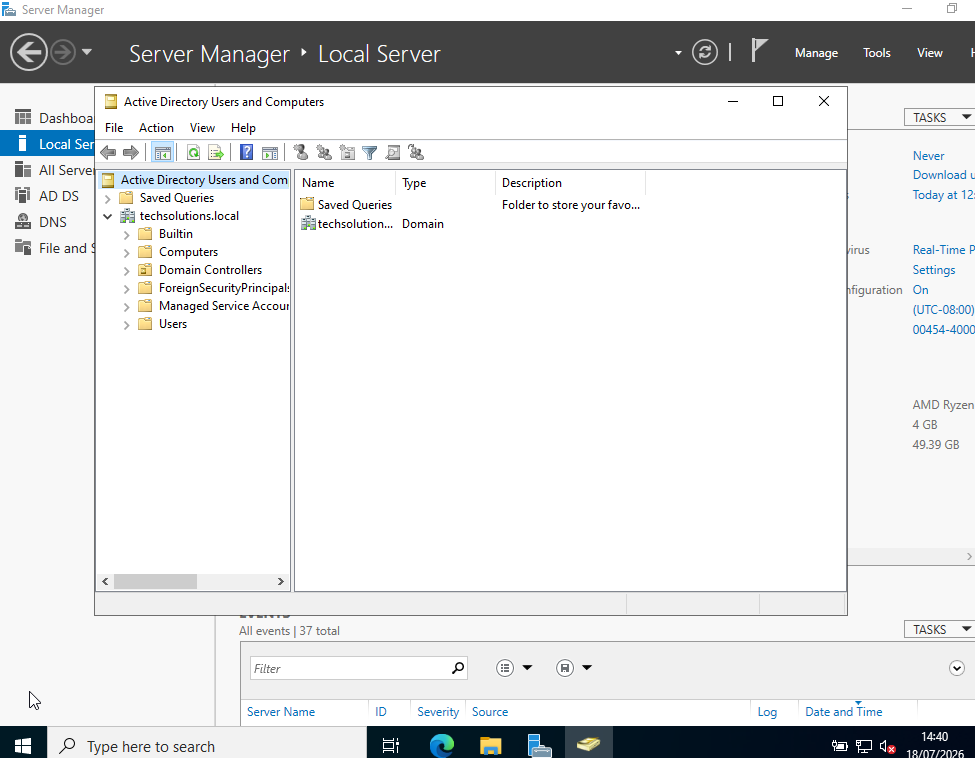
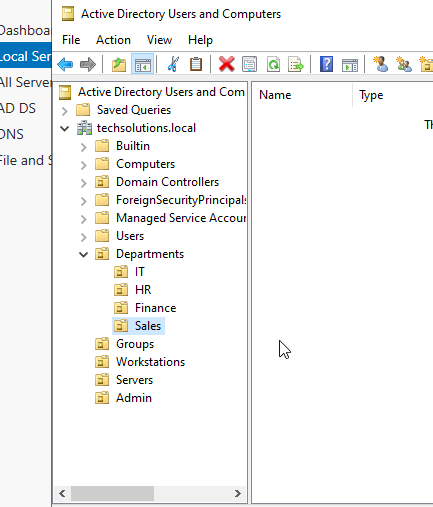
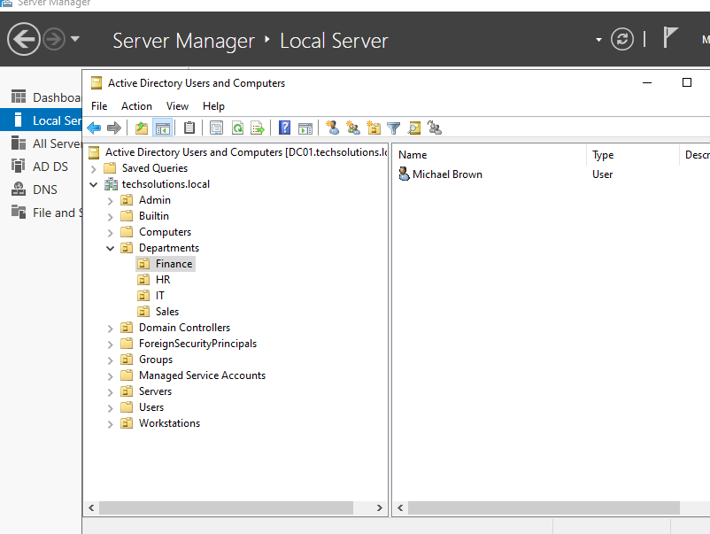
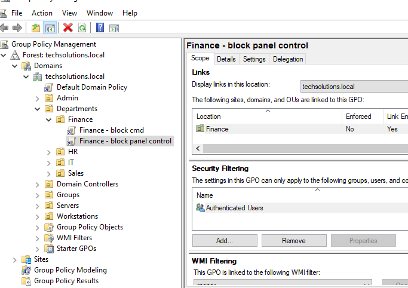
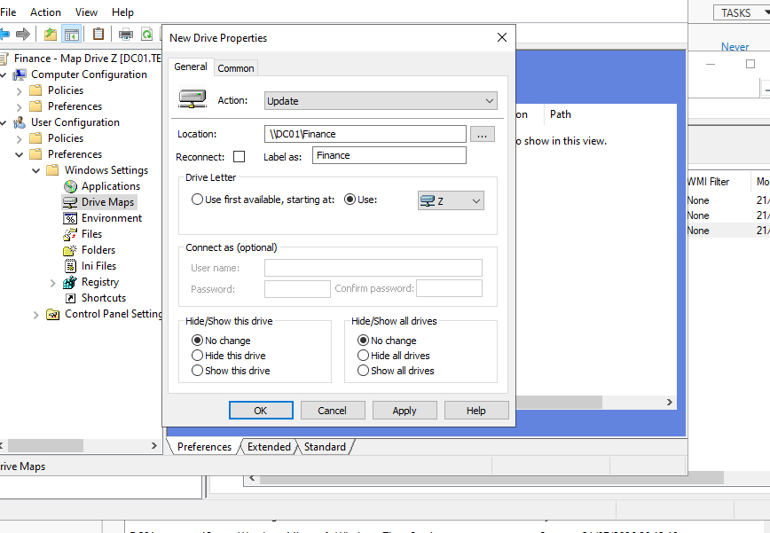
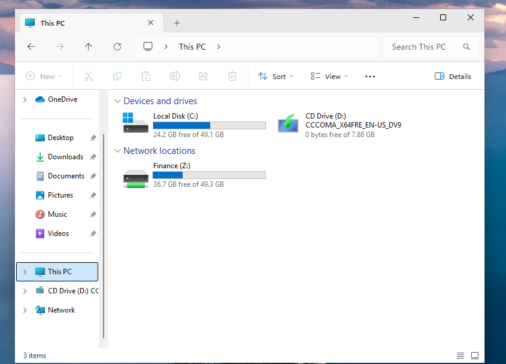

# Active Directory Home Lab

A home lab built with **Windows Server 2022** and **Windows 11 Pro** to simulate a small enterprise Active Directory environment.

This project demonstrates the deployment, configuration, and administration of Active Directory Domain Services (AD DS), including user management, Organizational Units (OUs), Group Policy Objects (GPOs), and automatic network drive mapping.

---

## Project Overview

The objective of this project was to gain hands-on experience with enterprise Windows Server administration by implementing a complete Active Directory environment.

The lab includes:

- Active Directory Domain Services (AD DS)
- DNS
- Organizational Units (OUs)
- Domain Users
- Group Policy Objects (GPO)
- SMB File Sharing
- Automatic Network Drive Mapping
- Windows Server Administration

---

# Lab Environment

The environment was built using **Oracle VirtualBox** with two virtual machines.

| Machine | Operating System | Role |
|----------|------------------|------|
| DC01 | Windows Server 2022 | Domain Controller |
| CLIENT01 | Windows 11 Pro | Domain Client |

The Domain Controller provides:

- Active Directory Domain Services
- DNS
- Authentication
- Group Policy Management

The client machine is joined to the domain and is used to validate all configurations.

---

# Domain Controller Configuration

Windows Server 2022 was configured as the Domain Controller responsible for managing the entire Active Directory infrastructure.

The server was prepared before installing Active Directory by configuring the operating system and assigning the appropriate network settings.

---

# Active Directory Domain

A new Active Directory forest named **techsolutions.local** was successfully deployed.

This domain provides centralized authentication, authorization, and policy management for all domain users and computers.

---

# Organizational Unit Structure

To simulate a real business environment, Organizational Units (OUs) were created to organize departments and administrative resources.

The environment contains dedicated Organizational Units for:

- IT
- HR
- Finance
- Sales
- Groups
- Servers
- Workstations
- Administration

This structure simplifies administration and allows Group Policies to be applied only where needed.

---

# User Management

A domain user was created inside the Finance Organizational Unit to represent an employee.

Users are organized according to their department, making administration and policy assignment more efficient.

---

# Group Policy Management

Group Policy Objects (GPOs) were created to centrally manage user configurations.

Policies were linked to the appropriate Organizational Units to demonstrate centralized administration within the domain.

Examples include:

- Restricting Command Prompt access
- Configuring automatic drive mapping

---

# Drive Mapping with Group Policy Preferences

A Group Policy Preference was configured to automatically map the Finance shared folder as drive **Z:** whenever Finance users log in.

Configuration:

- Action: Update
- Drive Letter: Z:
- Network Path: `\\DC01\Finance`

This eliminates the need for manual drive mapping and demonstrates a common enterprise administration task.

---

# Validation

After logging in as a Finance user, the network drive was automatically mapped.

This confirms that:

- Active Directory authentication is working
- Group Policy is applied successfully
- SMB file sharing is correctly configured
- Drive Mapping is functioning as expected

---

# Technologies Used

- Windows Server 2022
- Windows 11 Pro
- Oracle VirtualBox
- Active Directory Domain Services (AD DS)
- DNS
- Group Policy Management
- Organizational Units (OUs)
- SMB File Sharing
- Group Policy Preferences

---

# Skills Demonstrated

- Windows Server Administration
- Active Directory Deployment
- DNS Configuration
- Organizational Unit Design
- User Management
- Group Policy Administration
- SMB File Sharing
- Drive Mapping
- Windows Troubleshooting

---

# Future Improvements

This lab will continue to evolve with additional enterprise features, including:

- PowerShell automation for user provisioning
- Roaming Profiles
- Folder Redirection
- Group Policy Security Settings
- File Server enhancements
- Additional Windows Server roles

---

## Author

**Karen Cristina**

Aspiring IT Support / System Administrator with hands-on experience in Windows Server, Active Directory, Networking, and Cybersecurity.

Currently expanding this home lab to simulate real-world enterprise environments.
